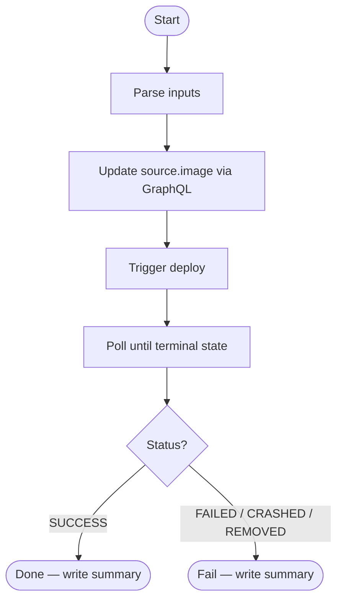

# Spryx Deploy Action

GitHub Action to deploy a Docker image to Railway and wait for the deployment to complete.

## Flow



## How it works

1. The CI pipeline builds the Docker image with `RELEASE` baked in as a build arg
2. The image is published to a registry (e.g. GHCR)
3. This action updates the `source.image` of the Railway service via GraphQL API and triggers the deploy
4. It then polls the Railway API every 10 seconds until the deployment reaches a terminal state (`SUCCESS`, `FAILED`, `CRASHED`)

For multiple services, use a [GitHub Actions matrix strategy](https://docs.github.com/en/actions/using-jobs/using-a-matrix-strategy-for-your-jobs).

## Inputs

| Input | Required | Default | Description |
|---|---|---|---|
| `service_id` | ✅ | — | Railway service ID |
| `image` | ✅ | — | Docker image to deploy (e.g. `ghcr.io/org/app:v1.2.3`) |
| `environment_id` | ✅ | — | Railway environment ID |
| `environment` | ✅ | — | Target environment name (e.g. `staging`, `production`) |
| `railway_token` | ✅ | — | Railway workspace token |
| `deploy_wait_timeout_minutes` | ❌ | `10` | How long to wait for the deployment to reach a terminal state (minutes) |

## Usage example

```yaml
name: Deploy

on:
  push:
    tags:
      - 'v*'

jobs:
  build-and-push:
    runs-on: ubuntu-latest
    outputs:
      version: ${{ steps.version.outputs.value }}
    steps:
      - uses: actions/checkout@v6

      - name: Extract version from tag
        id: version
        run: echo "value=${GITHUB_REF_NAME#v}" >> $GITHUB_OUTPUT

      - name: Log in to GHCR
        uses: docker/login-action@v3
        with:
          registry: ghcr.io
          username: ${{ github.actor }}
          password: ${{ secrets.GITHUB_TOKEN }}

      - name: Build and push
        uses: docker/build-push-action@v5
        with:
          context: .
          push: true
          tags: ghcr.io/my-org/my-app:${{ steps.version.outputs.value }}
          build-args: RELEASE=my-app@${{ steps.version.outputs.value }}

  deploy:
    needs: build-and-push
    runs-on: ubuntu-latest
    steps:
      - uses: Spryx-AI/spryx-deploy-action@v2
        with:
          service_id: srv_abc123
          image: ghcr.io/my-org/my-app:${{ needs.build-and-push.outputs.version }}
          environment_id: env_xyz789
          environment: production
          railway_token: ${{ secrets.RAILWAY_TOKEN }}
```

## Required secrets

| Secret | Description |
|---|---|
| `RAILWAY_TOKEN` | Railway workspace token |
