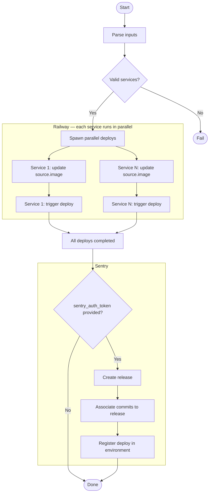

# Spryx Deploy Action

GitHub Action to deploy Docker images to Railway with Sentry release tracking.

## Flow



## How it works

The expected workflow is:

1. The CI pipeline builds the Docker image with `RELEASE` baked in as an environment variable
2. The image is published to a registry (e.g. GHCR)
3. This action updates the `source.image` of each Railway service via GraphQL API and triggers the deploy
4. Optionally, registers the release and deploy in Sentry

Since `RELEASE` lives inside the image, there is no risk of inconsistency between the variable and the running container — if the deploy fails, the old container keeps running with its own version.

## Inputs

| Input | Required | Description |
|---|---|---|
| `services` | ✅ | JSON array of `{ serviceId, image }` pairs |
| `environment_id` | ✅ | Railway environment ID |
| `environment` | ✅ | Target environment name (`staging` or `production`) |
| `railway_token` | ✅ | Railway workspace token |
| `release_name` | ✅ | Release name (e.g. `my-app@1.2.3`) |
| `sentry_auth_token` | ❌ | Sentry auth token |
| `sentry_org` | ❌ | Sentry organization slug |
| `sentry_projects` | ❌ | Comma-separated Sentry project slugs |

## Usage example

```yaml
name: Deploy

on:
  push:
    tags:
      - 'v*'

jobs:
  build-and-push:
    runs-on: ubuntu-latest
    outputs:
      version: ${{ steps.version.outputs.value }}
    steps:
      - uses: actions/checkout@v4

      - name: Extract version from tag
        id: version
        run: echo "value=${GITHUB_REF_NAME#v}" >> $GITHUB_OUTPUT

      - name: Log in to GHCR
        uses: docker/login-action@v3
        with:
          registry: ghcr.io
          username: ${{ github.actor }}
          password: ${{ secrets.GITHUB_TOKEN }}

      - name: Build and push my-app
        uses: docker/build-push-action@v5
        with:
          context: ./my-app
          file: ./my-app/Dockerfile
          push: true
          tags: ghcr.io/my-org/my-app:${{ steps.version.outputs.value }}
          build-args: |
            RELEASE=my-app@${{ steps.version.outputs.value }}

      - name: Build and push my-worker
        uses: docker/build-push-action@v5
        with:
          context: ./my-worker
          file: ./my-worker/Dockerfile
          push: true
          tags: ghcr.io/my-org/my-worker:${{ steps.version.outputs.value }}
          build-args: |
            RELEASE=my-worker@${{ steps.version.outputs.value }}

  deploy:
    needs: build-and-push
    runs-on: ubuntu-latest
    steps:
      - uses: Spryx-AI/spryx-deploy-action@v1
        with:
          services: |
            [
              { "serviceId": "srv_abc123", "image": "ghcr.io/my-org/my-app:${{ needs.build-and-push.outputs.version }}" },
              { "serviceId": "srv_def456", "image": "ghcr.io/my-org/my-worker:${{ needs.build-and-push.outputs.version }}" }
            ]
          environment_id: env_xyz789
          environment: production
          railway_token: ${{ secrets.RAILWAY_TOKEN }}
          # release_name typically uses the primary service name; both my-app and my-worker are deployed under this release
          release_name: my-app@${{ needs.build-and-push.outputs.version }}
          sentry_auth_token: ${{ secrets.SENTRY_AUTH_TOKEN }}
          sentry_org: my-org
          # Sentry project slugs may differ from service names — adjust to match your Sentry projects
          sentry_projects: my-app,my-worker
```

## Required secrets

| Secret | Description |
|---|---|
| `RAILWAY_TOKEN` | Railway workspace token |
| `SENTRY_AUTH_TOKEN` | Sentry auth token (optional) |
